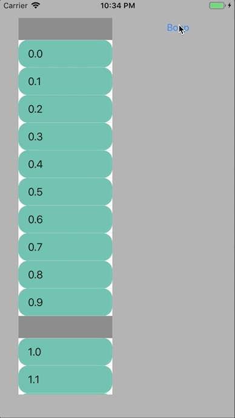
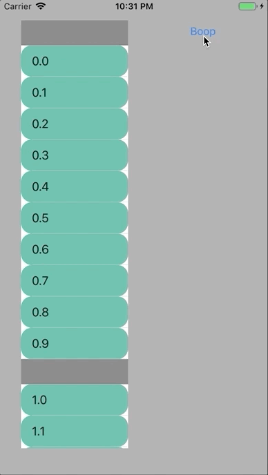

# Resizing subviews in `UITableViewCell`s with animation when using frame-based layout

There is a `UITableView` trick to animate cell height change without reloading cells (e.g. `reloadRows(at:with:)`),
as mentioned in the [official documentation](https://developer.apple.com/documentation/uikit/uitableview/1614908-beginupdates):

```swift
tableView.beginUpdates()
tableView.endUpdates()
```

If the cell has some subviews that should resize along with the cell, most of the time,
we want these subviews to resize **with animation** as well.

## Adaptive sizing of the subview using frame-based layout through `layoutSubviews`

Auto Layout is very, very useful, but sometimes (maybe due to performance reasons) we do want to manually set the cell's subviews' frames.

This can be achieved by overriding the cell's `layoutSubviews` method:

```swift
override func layoutSubviews() {
    super.layoutSubviews()

    // Manually set the cell subviews' frames.
}
```

## Incompatibility with cell resize animation

An example of the above method is in
[`SandboxCell`'s `layoutSubviews` method implementation](/ResizeTableViewCellSubviewsWithAnimation/ResizeTableViewCellSubviewsWithAnimation/SandboxCell.swift),
particularly when (1) is commented out and (2) is uncommented.

However, when running this project, when pressing the button to resize the cell, the growing cell will output three lines,
corresponding to three `layoutSubviews` passes:

```
bounds:(0.0, 0.0, 150.0, 44.0) targetFrame:(0.0, 0.0, 150.0, 84.0) <-- discrepancy!
bounds:(0.0, 0.0, 150.0, 84.0) targetFrame:(0.0, 0.0, 150.0, 84.0)
bounds:(0.0, 0.0, 150.0, 84.0) targetFrame:(0.0, 0.0, 150.0, 84.0)
```

In the first `layoutSubviews` pass, we prematurely resize the `bubble` before the cell itself has begun resizing. In other words,
the subview's frame update occurs even before entering the `CATransaction` that is triggered by the `endUpdates()` call.

As a result, the subview's resize will not be animated:

|(1)|(2)|
|--|--|
|||

## Discussion

### "Correct" approach

The discrepancy comes from self-sizing the subview without relying on the cell's bounds. The correct approach is to only size subviews based
on the cell's bounds. This way, the subviews will only resize when the cell itself has resized (which is a good indicator that we're in the
middle of a `CATransaction`, which in turn should let us piggyback our subview's resize into the animation).

An alternative is to ditch frame-based layouting for Auto Layout, but this comes at the cost of refactoring, as well as some performance cost, 
which might not be negligible given that we're in a table view.

### Approaches attempted, but don't work

* Wrapping the `beginUpdates()/endUpdates()` pair in a `CATransaction`:

```swift
CATransaction.begin()
tableView.beginUpdates()
tableView.endUpdates()
CATransaction.commit()
```

The above doesn't work.
